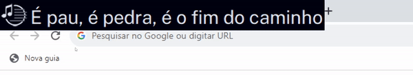

<p align="center">
 
 <h2 align="center">Overlyrics</h2>
 <p align="center">Bringing the lyrics to life!</p>
</p>
  <p align="center">
    <a href="https://www.python.org">
      
    </a>
    <a>
      
    </a>
    <br />
    <br />
    <a>
      
    </a>
    <a>
      
    </a>
    <a>
      
    </a>
    <a>
      
    </a>
  <p align="center">
    <a href="readme.md">English </a>
    ·
    <a href="#versão-em-português">Português</a>
  </p>
 <p align="center">
   <a>
      
    </a>
  </p>


## What is it?
Coded in Python using Tkinter, Spotipy and SyncedLyrics, Overlyrics is an application that displays real-time song lyrics in the corner of the screen. 

## Requirements and usage
There are a few options for running Overlyrics:

### 1. By running the installer (Windows)
Download the [installer](/Setup%20Installer%20-%20Overlyrics.exe?download=), run and proceed. The installer will optionally create a shortcut on desktop. You can run it or search the app in the Windows.

### 2. By running the executable (Windows)
Download the [executable file](/Overlyrics.exe?download=), and the folders [fonts](/fonts?download=), [icons](/icons?download=), [imgs](/imgs?download=) and [tkinther-themes](/tkinter-themes?download=). Please be sure that `Overlyrics.exe` is installed in the same directory that the other folders downloaded. 
Run `Overlyrics.exe`.

### 3. Building the Python code
Download all the repository, excepting by the `.exe` files. Install the requirements using pip:

``` 
pip install requirements.txt
```

Run the application with:
``` 
python Overlyrics.py
```

<p align="center">
 <a>
    
  </a>
</p>

## Support the Project

You can support the project in a number of ways:
* __Starring__: If you find the app useful, consider starring the repository.
* __Reporting Issues__: If you find a bug or have a suggestion for a new feature, 
  please report it via the [Issue tab](https://github.com/CezarGab/Overlyrics/issues).
* __Contributing Code__: If there is an open issue that you think you can help with, 
  submit a pull request.
  

## License
This repository is licensed under the [MIT License](https://github.com/CezarGab/Overlyrics/blob/main/LICENSE). If you contribute
to the project, you agree that your contributions are likewise licensed through
the MIT License. 


# Versão em português:
## O que é?
Feito em Python utilizando Tkinter, Spotipy e SyncedLyrics, Overlyrics é um programa que exibe letras de música em tempo real no canto da tela. 

## Requerimentos e execução
Há algumas opções para executar Overlyrics:

### 1. Rodando o instalador (Windows)
Baixe o [instalador](/Setup%20Installer%20-%20Overlyrics.exe?download=), execute-o. O instalador criará um atalho opcional na Área de Trabalho. Você pode rodá-lo ou pesquisar pelo aplicativo no Windows.

### 2. Rodando o executável (Windows)

Baixe o [arquivo executável](/Overlyrics.exe?download=), e as pastas [fonts](/fonts?download=), [icons](/icons?download=), [imgs](/imgs?download=) and [tkinther-themes](/tkinter-themes?download=). Certifique-se que `Overlyrics.exe` está instalado na mesma pasta que estas outras pastas. 
Execute `Overlyrics.exe`.

### 3. Rodando o código em Python
Baixe todo o repositório, com exceção dos arquivos `.exe`. Instale os requerimentos utilizando pip:

``` 
pip -r requirements.txt
```

Execute o programa:
``` 
python Overlyrics.py
```

## Apoie o projeto

Você pode apoiar o projeto de algumas maneiras:
* __Clicando em 'Star'__: Se você considera útil, pense em dar estrea ao repositório.
* __Reportando Issues__: Se você encontrar bugs ou tiver alguma sugestão, 
  reporte através da [Issue tab](https://github.com/CezarGab/Overlyrics/issues).
* __Contribuindo__: Se houver alguma Issue que você puder ajudar, 
  envie uma pull request.
  

## Licença
Este repositório está licensiado pela [MIT License](https://github.com/CezarGab/Overlyrics/blob/main/LICENSE). Se você contribuir, estará concordando que as contribuições também estejam abarcados nesta licença.

